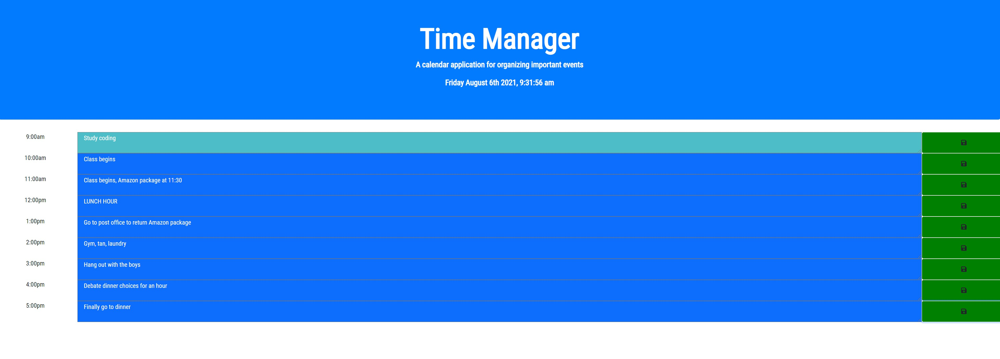

# Day-Planner-Application

## Description

A Bootstrap and jQuery powered day planner for organizing tasks in a regular business day. Click the green button with the save icon to log your event. Saved tasks will persist upon reload.

As the day progresses, each time block will eventually go from blue (future) to bright blue (the current hour), to greyed out (past event).

## Installation & Access

To access the project, visit my [GitHub Pages](https://patrickbrown-io.github.io/Day-Planner-Application/)

## Usage

Feel free to use this tool to plan your business day!

## Credits

[Patrick Brown](https://github.com/patrickbrown-io)

## Features

-Bootstrap Layout
-jQuery
-Local Storage
-Moment.js

## How to Contribute

Send me a message with recommendations on how to build out the applicaiton! Would love to add in features for clearing saved events and making each block moveable.
